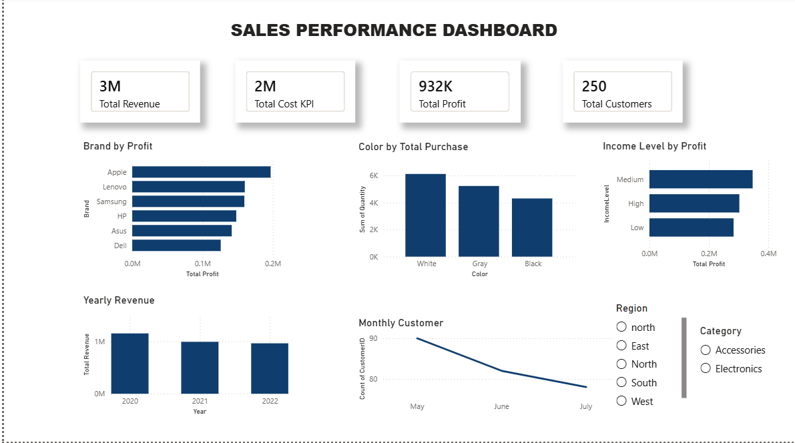

# Sales Performance Dashboard

## Project Overview
This project is an interactive Sales Performance Dashboard built using Power BI. The dashboard analyzes sales performance, profitability, customer trends, and product insights to support data-driven decision-making.

---

## Objectives
- Analyze total revenue, cost, profit, and customers
- Identify the most profitable brands
- Identify the most purchased product colors
- Track yearly revenue trends
- Analyze monthly customer performance
- Compare profit across customer income levels

---

## Tools Used
- Power BI
- Microsoft Excel

---

## Key KPIs
- Total Revenue
- Total Cost
- Total Profit
- Total Customers

---

## Dashboard Features
- Brand by Profit
- Color by Total Purchase
- Yearly Revenue
- Monthly Customer Trend
- Income Level by Profit
- Interactive slicers for Region and Category

---

## Dashboard Preview

---

## Files Included
- 
- 

---

## Key Insights
- Apple generated the highest profit among all brands
- White products recorded the highest purchases
- Monthly customer count declined from May to July
- Medium income customers generated the highest profit

---

## Author
Cynthia Mangs  
Data Analyst | Power BI Enthusiast
